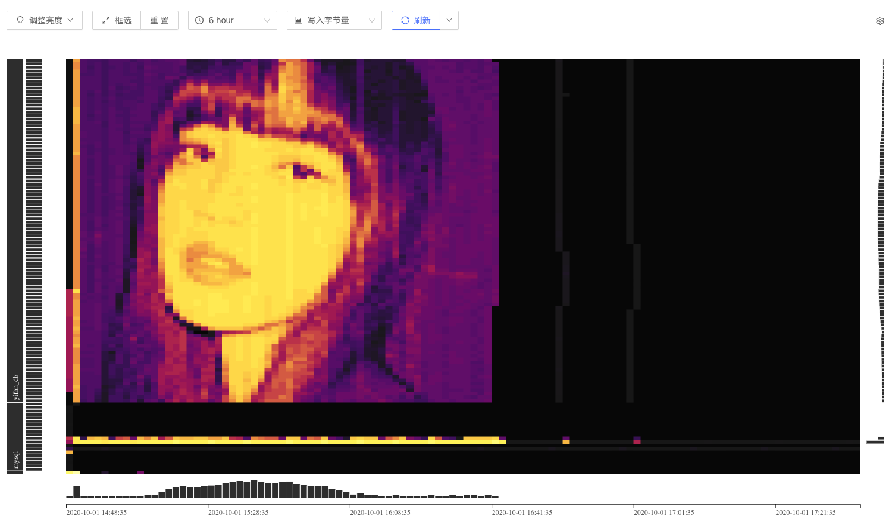

# homework

First turn on a TiDB locally on my Mac.
```
$ tiup playground
```

Then run the script `test.py` to create tables and write data to those tables.
```
python test.py
```

Login the dashboard through http://127.0.0.1:2379/dashboard to watch Key Visualizer. After some time (about two hours), we can see the following figure's pattern.



Here is the original portrait of Lisa.

